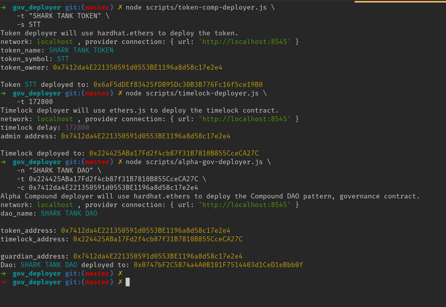

DAO Contracts Deployer
======================
A tool to deploy governance and related contracts supported by Tally via CLI. 

All the contracts disclosed here are opinated versions of it. And you can always redesign and modified if they stick to the overall pattern.

----------------
# Gov Deployer
## About

Gov deployer is dev tool created by developers in tally, in special [Arthur](github.com/afa7789).
It's main purpose is to deploy the contracts that tally support in their products with a single line of command.

To skip reading too much and go directly to the commands [click here](#deployments) and to go to the [table of content click here](#table-of-content).

### Which Governance should I use ?

Are you still unsure on what governance to use, let's us help you!

The more usual governances are Alpha and Bravo, from the compound governance, we could say that they created the initial pattern and following it we have OpenZepellin governance contract. Tally recommends you to use Openzeppelin contract, because it will be the one with more support and less chance of being deprecated, and it is too the contracts with more longevity, maintenance and support. 

Look up this comparison chart bellow, to see which one is the best for you.

| α Governor Alpha                                                          	| β Governor Bravo                                                        	| ℥ Governor OpenZepellin                                                 	|
|---------------------------------------------------------------------------	|-------------------------------------------------------------------------	|-------------------------------------------------------------------------	|
| 🛑 Non-upgradable contract.                                                	| 🛠️ Built in upgradability.                                               	| 🧰 Built in upgradability and more customization.                        	|
| 🔀 Parameter changes require contract migration.                           	| 🔁 Parameter changes uses static contract address, no migrations needed. 	| 🔁 Parameter changes uses static contract address, no migrations needed. 	|
| ☑️ Yes and No vote options.                                                	| 🗳️ Yes, no and abstain vote options.                                     	| 🗳️ Yes, no and abstain vote options.                                     	|
| ❓ No additional context recorded with vote.                               	| 📝 option to add text comment to on-chain vote.                          	| 📝 option to add text comment to on-chain vote.                          	|
| ♻️ Each upgrade resets proposal number schema                              	| 📈 Continuous proposal numbers regardless of upgrades                    	| 📈 Continuous proposal numbers regardless of upgrades                    	|
| 📍 Supported, was the first governance version. Easier deploy system.  	| 🔩 Supported too since it is an upgrade to the Alpha version.         	| 🔮 Widely Supported, as a contract from open zeppelin. With more features and upgrades.                   	|
| ❌ Does not support off-chain proposal signatures.                         	| ❌ Does not support off-chain proposal signatures.                       	| ⛓️ Supports Off-chain proposal signatures.                               	|

### Table of content

- [Gov Deployer](#gov-deployer)
  - [About](#about)
    - [Which Governance should I use ?](#which-governance-should-i-use)
    - [Table of Content](#table-of-content)
    - [Pre-Requisites](#pre-requisites)
    - [Installation](#installation)
    - [Networks that Tally support](#networks-that-tally-support)
      - [Ethereum](#ethereum)
      - [Polygon](#polygon)
      - [Avalanche](#avalanche)
      - [Optimism](#optimism)
      - [Arbitrum](#arbitrum)
      - [Localhost](#localhost)
- [Deployments](#deployments)
  - [Compound](#compound)
    - [Alpha Deployment](#alpha-deployment)
      - [ERC20 Token](#erc20-token)
      - [Timelock contract deployment](#timelock-contract-deployment)
      - [Alpha Governance](#alpha-governance)
    - [Bravo Deployment](#bravo-deployment)
      - [Bravo Governance (Delegate)](#bravo-governance-delegate)
      - [Bravo Delegator](#bravo-delegator)
  - [OpenZepellin](#openzepellin)
  - [Nouns, NFTDao](#nouns-nftdao)

### Pre-Requisites

- Npm and Node.
- Git.

### Installation

```bash
git clone https://github.com/afa7789/gov_deployer.git && cd gov_deployer
yarn install
```

### Networks that Tally support

__Following we have the block explorers and the networks that are supported currently by Tally app.__

#### Ethereum
- Ethereum -  https://etherscan.io/
- Ethereum Testnet Göerli -  https://goerli.etherscan.io/
- Ethereum Testnet Rikenby - https://rinkeby.etherscan.io/
- Ethereum Testnet Kovan - https://kovan.etherscan.io/

#### Polygon
- Polygon (Matic) - https://polygonscan.com/
- Polygon Testnet Mumbai - https://mumbai.polygonscan.com/

#### Avalanche
- Avalanche - https://snowtrace.io/
- Avalanche Testnet Fuji - https://testnet.snowtrace.io/

#### Optimism
- Optimism - https://optimistic.etherscan.io/
- Optimism Kovan - https://kovan-optimistic.etherscan.io/
- Optimism Goerli - * missing etherscan explorer *

#### Arbitrum
- Arbitrum One - https://arbiscan.io/
- Arbitrum Rinkeby - https://testnet.arbiscan.io/

#### Localhost
- Localhost - http://localhost:8545/
- Blockexplorer I suggest using Ganache: https://github.com/trufflesuite/ganache-ui

To add funds to other accounts you can add the chain to your metamask:
    - Name: Hardhat
    - URL/RPC: http://121.0.0.1:8545 
    - Chain ID: 31337
    - Currency: ETH

Run `npx hardhat node` , it will start the node and print the private_keys and pub_keys, add one of them to your metamask, so you can send funds from that account to others.

If you ever reset the node, the configurations such as block nounce, and other configs in metamask have to be reset. To do so follow these steps: SETTINGS >> ADVANCED >> scroll down >> RESET ACCOUNTS (this will reset the state of them in the networks), and you can use again with localhost.

------------------------------------

# Deployments

In this section we are going to cover all the tasks and deployment possible to be made with gov_deployer.

We are going to list commands to call and their variables to deploy.

By doing so you will now what to call in order to get the scenario and governance that you want.

The network name based in `--network` option, have to follow the network name in the _`hardhat.config.js`_ file.

In all tasks the variable `--network lower_case_name` will be optional with default:localhost

First of all run both of this.
```bash
npx hardhat compile
npx hardhat node # if you're running it locally
```

## Compound

The following section contains the scripts which will deploy the Compound Alpha version of the governance contracts.

Compound is DAO that created two patterns of Governance contracts Alpha and Bravo.

The compound contracts were tinkered with the proposal of allowing us to set their names and symbols during deployment time. So if you need to change some of the variables it's recommended to change in contract and run `npx hardhat compile` to update the contract.

### Alpha Deployment

Deploy in one go all the contracts to create an Alpha Compound style governance.

The contracts are deployed in the following order __1st the token__, __2nd the timelock__, __3rd the governance__. 

```bash
npx hardhat alpha_dao \
    --name DAO_NAME \
    --token TOKEN_NAME \
    --symbol TKN \
    --delay time_in_seconds_between_172800_2592000
    --owner 0x_ADDRESS_OF_OWNER_OF_TOTAL_TOKENS #Optional, default value is the deployer address
    --guardian 0x_ADDRESS_OF_OWNER_OF_TOTAL_TOKENS # Optional default as the deployer address.
```

#### ERC20 Token

You can find the token contract code here: [ERC20Comp.sol](contracts/Compound/ERC20Comp.sol)

```bash
npx hardhat comp_token \
    --name TOKEN_NAME \
    --symbol TKN \
    --owner 0x_ADDRESS_OF_OWNER_OF_TOTAL_TOKENS #Optional, default value is the deployer address
```
#### Timelock contract deployment

You can find the timelock contract code here: [TimeLock.sol](contracts/Compound/Timelock.sol)

```bash
npx hardhat comp_timelock \
    --delay time_in_seconds_between_172800_2592000
```

You should deploy the governance contract right after deploying the Timelock one.

#### Alpha Governance

You can find the dao contract code here: [AlphaGovernor.sol](contracts/Compound/AlphaGovernor.sol)

```bash
npx hardhat alpha_governance \
    --name DAO_NAME \
    --timelock 0x_ADDRESS_OF_TIMELOCK_CONTRACT \
    --token 0x_ADDRESS_OF_TOKEN_CONTRACT \
    --guardian 0x_ADDRESS_OF_OWNER_OF_TOTAL_TOKENS # Optional default as the deployer.
```
------------------------------------
### Bravo Deployment

Deploy in a single command all the contracts needed to create an Bravo Compound style governance.

To deploy bravo you need to deploy __1st the token__, __2nd the timelock__, __3rd the delegate__ and __4th delegator__. Delegator is the main governance contract and delegate is the governance contract used as a proxy to the delegator.

```bash
npx hardhat bravo_dao \
    --name DAO_NAME \
    --token TOKEN_NAME \
    --symbol TKN \
    --delay time_in_seconds_between_172800_2592000
    --owner 0x_ADDRESS_OF_OWNER_OF_TOTAL_TOKENS #Optional, default value is the deployer address
    --guardian 0x_ADDRESS_OF_OWNER_OF_TOTAL_TOKENS # Optional default as the deployer address.
```

#### Bravo Governance 

Bravo governance delegator is the main contract which points to the other contracts and should be the admin of the timelock.

Bravo governance delegate is the logic for the governance contract. It is used by delegator with the proxy approach. This can be redeployed when they want to upgrade the governance.
##### Delegate

You can find the dao contract code here: [BravoGovernorDelegate.sol](contracts/Compound/BravoGovernorDelegate.sol)

```bash
npx hardhat bravo_delegate \
    --name DAO_NAME
```

##### Delegator

When the bravo delegator is deployed the governance is initialized. This is the last contract you deploy in the Bravo schema. You can find the dao contract code here: [GovernorBravoDelegator.sol](contracts/Compound/GovernorBravoDelegator.sol)

```bash
npx hardhat bravo_delegator \
    --timelock 0x_ADDRESS_OF_TIMELOCK_CONTRACT \
    --token 0x_ADDRESS_OF_TOKEN_CONTRACT \
    --admin 0x_ADDRESS_OF_ADMIN \ # Optional
    --governance 0xADDRESS_OF_BRAVO_GOVERNOR_CONTRACT \
    --delay time_in_seconds \ # optional
    --threshold time_in_seconds \ #optional
    --period time_in_seconds \ #optional
```
------------------------------------
## OpenZepellin
⚠️⚠️ __WORKING ON IT__ ⚠️⚠️

## Nouns, NFTDao
⚠️⚠️ __WORKING ON IT__ ⚠️⚠️

# Token/NFT Distribution
⚠️⚠️ __WORKING ON IT__ ⚠️⚠️

__Future planning:__
- OpenZepellin.
- ERC721 deploy and mint.
- Add a pluggin usage to add it to the Tally website.

----------------------

This repository is incomplete as I'm still ⚠️⚠️ __WORKING ON IT__ ⚠️⚠️. If you have any suggestions or tips in improving it please mail me: arthur@withtally.com




<!-- 
## OpenZepellin DAO 

### with ERC20 Token

### with ERCO Wrapped Token

### with ERC721 Votes

## Compound Alpha

### with ERC20 Token

### with Wrapped Token

## Compound Bravo

### with ERC20 Token

### with Wrapped Token

If possible:
------------
## Compound Alpha with ERC721 Votes

## Compound Bravo with ERC721 Votes 


# Basic Sample Hardhat Project

This project demonstrates a basic Hardhat use case. It comes with a sample contract, a test for that contract, a sample script that deploys that contract, and an example of a task implementation, which simply lists the available accounts.

Try running some of the following tasks:

```shell
npx hardhat accounts
npx hardhat compile
npx hardhat clean
npx hardhat test
npx hardhat node
node scripts/sample-script.js
npx hardhat help
npx hardhat run --network <your-network> scripts/token-deployer.js --parameter1 one --parameter2 two --parameter3 three
npx hardhat verify --network goerli 0x8b91856Fe8B29493e615fBCA81B94B61DFcc670C 'Hello, Hardhat!'

```
-->